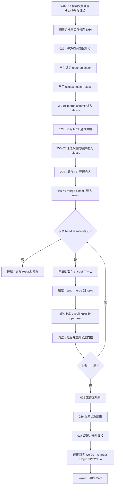

# Wave 0 Baseline Governance Coordination Implementation Plan

> **For agentic workers:** REQUIRED SUB-SKILL: Use superpowers:subagent-driven-development (recommended) or superpowers:executing-plans to implement this plan task-by-task. Steps use checkbox (`- [ ]`) syntax for tracking.

**Goal:** 把当前十层叠加 PR 收成一个有 CI 强制门禁、MCP 安全边界明确、状态可追溯的 `main` 基线，同时保持 WIP=1 和每项改动可独立审核、回滚。

**Architecture:** 本文件只充当协调 Module：保存依赖图、状态机、合入门槛和停止条件，不承载任何业务或 CI Implementation。W0-00 文档 PR 是本规格、协调计划、六份已批准子计划 `docs/plans/022`–`027` 和 W0-03 PR 审计台账的唯一版本化载体；这些文档不混入各实现 PR。每份子计划先在 W0-00 独立 worktree 中单独起草、Review Gate 和批准，再作为单独协调提交 push；对应实现分支只能在该计划远端 readback 后创建。同一时间只有一个工作项可处于 active，达到 `fixed-on-branch` 后可以冻结并释放活动槽位，但冻结项在重新取得槽位前不得继续修改。

**Tech Stack:** zsh、Git、GitHub CLI、jq、GitHub Pull Requests / Actions / Rulesets、Python 3.11、uv、pytest、Markdown。

---

## 0. 当前进度

| 步骤 | 状态 | 核实命令 / 实际偏差 |
|---|---|---|
| 产品与架构规格 | 已核实 | 用户于 2026-08-18 批准 `docs/superpowers/specs/2026-08-17-stabilization-product-closure-design.md` |
| Q1 合并策略 | 已核实 | 用户批准 Wave 0 全链只使用 **Create a merge commit** |
| Q2 GitHub 强制门禁 | 已核实 | 用户批准 release 与 `main` 均启用 required check、strict/up-to-date、管理员不得绕过 |
| Q3 CI/#32 顺序 | 已核实 | 用户批准 CI 先行；#32 落地前禁止调用 `check_form_selectors` |
| Q4 strict 分支同步 | 已核实 | 用户批准保留 strict/up-to-date；每层 retarget 后把锁定的最新 `main` 以 merge commit 合入 topic，普通 push 单独审批，随后清空旧证据并重建候选 |
| PR/Issue/CI 快照 | 已核实 | 2026-08-18 执行 `gh api`：10 个 open PR、17 个 open Issue、0 个 workflow；执行前必须刷新，不把本行当永久事实 |
| 协调文档版本化 | fixed-on-branch | W0-00 Issue #34、远端分支 `docs/wave0-coordination` 与 draft PR #35 已创建；W0-00 当前状态和实时 base/head/merge SHA 只从 GitHub API 与 PR #35 live-state 读取，本文件不把历史观察当当前真值 |
| Wave 0 子计划 | 未开始 | 只允许按 W0-01 → W0-06 顺序逐份创建、审批和执行 |

### 0.1 实时 WIP 台账

| Key | Owner | Issue / Plan | Branch → Target | 状态 | Base / Head / Merge SHA | Freeze reason | 未验证项 | 最后核实 |
|---|---|---|---|---|---|---|---|---|
| W0-00 | 主 agent | #34 / 本文件 | `docs/wave0-coordination` → 先以 PR #21 head 分支为 draft base，W0-06 完成后最终 retarget `main` | fixed-on-branch | PR #35；当前 base/head/merge SHA 必须从 GitHub API 与 PR live-state 同次 readback，不从本文件恢复 | 等待下一次 ledger/子计划 sync；最终 retarget 要等 W0-06 verified-on-target | W0-01–W0-06 尚未执行；六份子计划尚未起草或批准 | `gh pr view 35 --repo fishINlab666/job-agent --json state,isDraft,baseRefOid,headRefOid,potentialMergeCommit`；PR #35 live-state readback |
| W0-01 | 主 agent | #36 / Plan 022 | `chore/wave0-clean-ci` → `release/0.2.0-two-phase-apply` | not-started | expected base=`50f5e35d2f32b171a5684de83be17070eeb8b1d5`; head/merge=`not-created` | none | 执行前刷新 PR #1 与 release head 并要求相等 | `gh pr view 1 --json headRefOid` |
| W0-02 | 主 agent | #32 / Plan 023 | `fix/issue-32-mcp-read-only` → updated release | not-started | base/head/merge=`not-created` | none | 等 W0-01 verified-on-target | 依赖 W0-01 |
| W0-03 | 主 agent | #37 / Plan 024 | 逐层 retarget + merge 锁定的 `main` 到 topic → `main` | not-started | base/head/merge=`not-created` | none | 等 W0-02 verified-on-target | 依赖 W0-02 |
| W0-04 | 主 agent | #38 / Plan 025 | change package → 仓库根目录相对路径 `../CLAUDE.md` | not-started | base/head/merge=`not-created` | none | 等 W0-03 verified-on-target | 依赖 W0-03 |
| W0-05 | 主 agent | #39 / Plan 026 | `docs/wave0-repo-governance` → `main` | not-started | base/head/merge=`not-created` | none | 等 W0-04 verified-on-target | 依赖 W0-04 |
| W0-06 | 主 agent | #40 / Plan 027 | `docs/wave0-feedback-ledger` → `main` | not-started | base/head/merge=`not-created` | none | 等 W0-05 verified-on-target | 依赖 W0-05 |

台账中的 `not-created` 是明确状态：对象尚不存在，不能填写 SHA。每次状态变化必须按 §4 的控制面换槽协议更新本表；同时最多一行可为 `active`，所有 frozen 行必须写明 Freeze reason。

## 1. 协调边界

本计划允许只读刷新远端事实、在 W0-00 中逐份创建并审批六份子计划，并在每份子计划单独获批、版本化 readback 后实施。它不允许在协调文件中直接修改代码或 workflow，也不允许同时实现两个子计划。

硬性禁区：

- 不使用 squash/rebase，不批量合并，不删除远端分支。
- 不把“只 retarget 后等待 strict check”当成可执行路径；每层必须先按 §2.2 同步锁定的 `main` 到 topic。
- 不在候选 SHA 变化后复用旧检查结果。
- 不在 #32 进入目标并验证前调用 `check_form_selectors` 或宣称 MCP 已严格只读。
- 不关闭尚未在目标验证的 Issue。
- 不提前开发 Wave 1–5 的调度、批量投递、新 ATS 或业务 Issue。

本文所有 `bash` 代码块都作为完整 zsh 脚本执行，第一行必须保持 `set -euo pipefail`；不得抽取 `test` 后面的远端写命令单独运行。任一断言或测试非零即停止，后续命令不得执行。

## 2. 已批准决策与硬门槛

### 2.0 执行输入契约

本文中的 `approved_*`、`w0_docs_root`、PR 编号、分支名和 SHA 都是运行时输入，不是可从旧 shell 会话继承的隐式状态。每次执行代码块前必须生成一份完整的 expanded zsh 脚本：在 `set -euo pipefail` 后用字面量赋值，逐项展示其来源（用户刚批准的台账行、W0-00 live-state 或 GitHub 当前只读快照）并请用户核对。获批值不得由同一执行块中的当前查询结果反向覆盖。

所有引用运行时输入的代码块都必须以 `: "${variable:?restore ...}"` 显式断言输入存在；若从台账或 live-state 无法恢复，立即 Gate BLOCK。文档中的示例赋值只用于说明字段形状，实际执行时必须替换成当次获批的字面量。路径类输入必须从 W0-00 台账恢复精确绝对路径，不得在另一工作树中临时猜测。

### 2.1 Git 合并策略

- W0-01、W0-02 和原叠加 PR 全部使用 **Create a merge commit**。
- 第一次 merge 前记录仓库原始 merge 设置，并在用户确认精确设置后暂时设为 `allow_merge_commit=true`、`allow_squash_merge=false`、`allow_rebase_merge=false`；Wave 0 完成后是否恢复原设置必须再次由用户决定。
- 每次合入后、retarget 下一层前，用获批的前序 PR/head 实际调用祖先检查：

```bash
set -euo pipefail
: "${approved_pr_number:?restore approved PR number from the ledger}"
: "${approved_head_sha:?restore approved head SHA from the ledger}"
git fetch origin main
verify_merged_head() {
  local pr_number="$1"
  local expected_head_sha="$2"
  local observed_head_sha
  observed_head_sha="$(gh pr view "$pr_number" --repo fishINlab666/job-agent --json headRefOid --jq .headRefOid)"
  test "$observed_head_sha" = "$expected_head_sha"
  git merge-base --is-ancestor "$expected_head_sha" origin/main
}
verify_merged_head "$approved_pr_number" "$approved_head_sha"
```

预期退出码为 `0`。非 `0` 立即停线；不得继续 retarget，必须另写整栈 restack 方案并重新审批。

### 2.2 strict/up-to-date topic 同步

对 `main` 的 Ruleset 保持 strict/up-to-date，因此剩余九层和 W0-00 最终 retarget 后，必须执行以下状态机：

1. 锁定当时的 `origin/main`、当前远端 topic head 和目标分支名；三者写入 WIP 台账。
2. 在隔离 worktree 的 detached topic head 上执行 `git merge --no-ff --no-edit <pinned_main_sha>`。有冲突立即停止并保留 worktree，不自动解决。
3. 验证锁定的 main 和原 topic head 均为新 head 的祖先；运行该层 Plan 024 规定的最快相关检查。
4. 再次 fetch；若 main 或远端 topic head 与锁定值不同，停止并废弃本次同步证据。
5. 向用户展示 PR、分支、锁定 main、原/新 topic head、检查结果和回退方式；取得这一次普通 fast-forward push 的单独批准。禁止 force-push。
6. push 后 topic readback 必须等于新 head，main readback 必须仍等于锁定 SHA；只有两者都成立才清空 retarget 前和 push 前的 base/head/merge/archive/check/merge-approval，重新执行 §2.5 候选 Gate。main 在窄竞态中移动时按下文记录“push 已发生、证据作废”，并从步骤 1 重来。

topic 同步 push 是独立远端写，不与 retarget 或最终 PR merge 共用批准。同步 merge 只让 topic 吸收已验证的 `main`，不改变该 PR 的业务范围；若 diff 出现范围外文件，Gate BLOCK。

准备同步 commit 时使用以下模板；`approved_pr_number` 与 `topic_branch` 必须按 §2.0 展开为当层字面量。该脚本只产生本地证据，结束后必须停下展示，不能顺带 push：

```bash
set -euo pipefail
: "${approved_pr_number:?restore approved PR number from the ledger}"
: "${topic_branch:?restore exact topic branch from the ledger}"
sync_repo_root="$(git rev-parse --show-toplevel)"
git fetch origin main "$topic_branch:refs/remotes/origin/$topic_branch"
pinned_main_sha="$(git rev-parse origin/main)"
topic_head_sha="$(gh pr view "$approved_pr_number" --repo fishINlab666/job-agent --json headRefOid --jq .headRefOid)"
test "$topic_head_sha" = "$(git rev-parse "origin/$topic_branch")"
sync_root="$(mktemp -d /tmp/job-agent-topic-sync.XXXXXX)"
git worktree add --detach "$sync_root/checkout" "$topic_head_sha"
cd "$sync_root/checkout"
git merge --no-ff --no-edit "$pinned_main_sha"
updated_topic_head_sha="$(git rev-parse HEAD)"
git merge-base --is-ancestor "$pinned_main_sha" "$updated_topic_head_sha"
git merge-base --is-ancestor "$topic_head_sha" "$updated_topic_head_sha"
git diff --check "$pinned_main_sha" "$updated_topic_head_sha"
uv sync --frozen
uv run pytest -q
cd "$sync_repo_root"
git fetch origin main "$topic_branch:refs/remotes/origin/$topic_branch"
test "$(git rev-parse origin/main)" = "$pinned_main_sha"
test "$(git rev-parse "origin/$topic_branch")" = "$topic_head_sha"
printf '%s\n' "$sync_root" "$pinned_main_sha" "$topic_head_sha" "$updated_topic_head_sha"
```

上一步的四个输出连同测试结果写入台账并展示。用户明确批准该次普通 push 后，才运行以下独立 expanded 脚本；所有值逐字恢复自刚批准记录：

```bash
set -euo pipefail
: "${sync_root:?restore approved sync worktree root}"
: "${topic_branch:?restore approved topic branch}"
: "${pinned_main_sha:?restore approved pinned main SHA}"
: "${topic_head_sha:?restore approved original topic head SHA}"
: "${updated_topic_head_sha:?restore approved updated topic head SHA}"
test "$(git -C "$sync_root/checkout" rev-parse HEAD)" = "$updated_topic_head_sha"
git -C "$sync_root/checkout" fetch origin main "$topic_branch:refs/remotes/origin/$topic_branch"
test "$(git -C "$sync_root/checkout" rev-parse origin/main)" = "$pinned_main_sha"
test "$(git -C "$sync_root/checkout" rev-parse "origin/$topic_branch")" = "$topic_head_sha"
git -C "$sync_root/checkout" push origin "HEAD:refs/heads/$topic_branch"
observed_topic_head_sha="$(git ls-remote origin "refs/heads/$topic_branch" | awk '{print $1}')"
observed_main_sha="$(git ls-remote origin refs/heads/main | awk '{print $1}')"
test "$observed_topic_head_sha" = "$updated_topic_head_sha"
test "$observed_main_sha" = "$pinned_main_sha"
```

普通 push 由服务端保证只能 fast-forward，且脚本已证明 `topic_head_sha` 是 `updated_topic_head_sha` 的祖先；不使用 force/force-with-lease。push 启动前的 fetch 可发现当时已发生的 main/topic 移动，但无法把 `main` 与 topic ref 作为一个原子事务锁定，因此必须诚实处理窄竞态：若 push 后 `observed_main_sha != pinned_main_sha`，本次 push 已发生但所有同步/候选证据立即作废，不得继续候选 Gate；从新 topic head 和新 main 重新同步。topic readback 不等于新 head 时同样停线。push readback 后保留同步 worktree，直到新候选 Gate 成功；随后运行下列清理脚本。脚本中任一断言失败都不得补跑 push：

```bash
set -euo pipefail
: "${sync_root:?restore completed sync worktree root from the ledger}"
git worktree remove "$sync_root/checkout"
case "$sync_root" in
  /tmp/job-agent-topic-sync.*) rmdir "$sync_root" ;;
  *) exit 1 ;;
esac
```

### 2.3 CI 自证契约

- workflow 事件只用 `pull_request`，覆盖 `opened`、`synchronize`、`reopened`、`edited`。
- base 分支覆盖 `release/0.2.0-two-phase-apply` 和 `main`，不使用路径过滤。
- 检查 GitHub 生成的 merge candidate，同时记录 base/head/merge SHA。
- 禁止 `pull_request_target`、secrets 和写权限；顶层 `permissions` 只能是 `contents: read`。
- 外部 Action 固定到完整 commit SHA，不得只写 tag。
- 执行 `uv sync --frozen` 与默认自包含全量测试；真实数据库、真实页面和真实登录态只作显式 opt-in 集成验证。

### 2.4 GitHub 强制门禁

- 首次稳定 check 名产生后，对 `release/0.2.0-two-phase-apply` 与 `main` 启用 required status check。
- 要求分支为最新（strict/up-to-date），管理员不得绕过。
- Ruleset 生效前只能称 manual-gate，不能称 hard-gate。
- Ruleset 执行前必须向用户展示目标分支、required check 精确名称、bypass 配置和回退方法。

### 2.5 候选验证门槛

每个准备合入的候选必须同时满足：

1. `git diff --check` 通过。
2. 不含未跟踪文件的 `git archive` 隔离目录中，`uv sync --frozen` 与 `uv run pytest -q` 退出码为 0。
3. GitHub required check 对同一个 merge candidate SHA 为 success。
4. base/head/merge SHA 与台账一致；任一 SHA 改变即清空旧证据。
5. 用户看到 PR 编号、三个 SHA、测试结果、风险和回退方式后，逐个批准 merge。

精确 merge candidate 必须通过以下 zsh 流程取得；变量值来自当前 PR 与实时台账，不允许手填猜测：

```bash
set -euo pipefail
candidate_pr_number=1
: "${required_check_name:?restore the Ruleset check name approved in W0-01}"
candidate_repo_root="$(git rev-parse --show-toplevel)"
candidate_snapshot="$(gh pr view "$candidate_pr_number" --repo fishINlab666/job-agent --json baseRefOid,headRefOid,potentialMergeCommit)"
candidate_base_sha="$(jq -r .baseRefOid <<<"$candidate_snapshot")"
candidate_head_sha="$(jq -r .headRefOid <<<"$candidate_snapshot")"
candidate_merge_sha="$(jq -r .potentialMergeCommit.oid <<<"$candidate_snapshot")"
test -n "$candidate_base_sha"
test -n "$candidate_head_sha"
test -n "$candidate_merge_sha"
git fetch origin "refs/pull/$candidate_pr_number/merge"
fetched_merge_sha="$(git rev-parse FETCH_HEAD)"
test "$fetched_merge_sha" = "$candidate_merge_sha"
git cat-file -e "$candidate_base_sha^{commit}"
git cat-file -e "$candidate_head_sha^{commit}"
git diff --check "$candidate_base_sha" "$fetched_merge_sha"
candidate_checks_json="$(gh api -H 'Accept: application/vnd.github+json' "repos/fishINlab666/job-agent/commits/$candidate_merge_sha/check-runs?filter=latest&per_page=100")"
matching_candidate_checks="$(jq --arg name "$required_check_name" --arg sha "$candidate_merge_sha" '[.check_runs[] | select(.name == $name and .head_sha == $sha)]' <<<"$candidate_checks_json")"
test "$(jq 'length' <<<"$matching_candidate_checks")" -eq 1
test "$(jq -r '.[0].status' <<<"$matching_candidate_checks")" = "completed"
test "$(jq -r '.[0].conclusion' <<<"$matching_candidate_checks")" = "success"
test "$(jq -r '.[0].app.slug' <<<"$matching_candidate_checks")" = "github-actions"
candidate_run_id="$(jq -r '.[0].details_url | capture("/actions/runs/(?<id>[0-9]+)").id' <<<"$matching_candidate_checks")"
candidate_check_suite_id="$(jq -r '.[0].check_suite.id' <<<"$matching_candidate_checks")"
candidate_run_json="$(gh api -H 'Accept: application/vnd.github+json' "repos/fishINlab666/job-agent/actions/runs/$candidate_run_id")"
test "$(jq -r .id <<<"$candidate_run_json")" = "$candidate_run_id"
test "$(jq -r .check_suite_id <<<"$candidate_run_json")" = "$candidate_check_suite_id"
test "$(jq -r .event <<<"$candidate_run_json")" = "pull_request"
test "$(jq -r .status <<<"$candidate_run_json")" = "completed"
test "$(jq -r .conclusion <<<"$candidate_run_json")" = "success"
candidate_archive_dir="$(mktemp -d /tmp/job-agent-candidate.XXXXXX)"
git archive "$fetched_merge_sha" | tar -x -C "$candidate_archive_dir"
cd "$candidate_archive_dir"
uv sync --frozen
uv run pytest -q
cd "$candidate_repo_root"
case "$candidate_archive_dir" in
  /tmp/job-agent-candidate.*) rm -rf -- "$candidate_archive_dir" ;;
  *) exit 1 ;;
esac
```

PR 不为 #1 时只改变 `candidate_pr_number`。`refs/pull/N/merge` 不存在、GitHub 返回空 SHA或两 SHA 不相等时立即 Gate BLOCK。合并命令必须再次读取当前 head/base/merge/check，与用户批准的台账行逐项相等，并传入 `--match-head-commit "$approved_head_sha"`；否则不执行 merge。

合并前必须再次用 `repos/fishINlab666/job-agent/commits/$approved_merge_sha/check-runs?filter=latest&per_page=100` 取得 check-run 快照，并断言：`head_sha` 等于 `approved_merge_sha`、名称等于 `approved_required_check_name` 的最新 check 恰有一个，且 `status=completed`、`conclusion=success`、`app.slug=github-actions`。随后从该 check 的 `details_url` 取得 Actions run ID，readback 并断言 run ID、`check_suite_id` 与该 check 相连，且 `event=pull_request`、`status=completed`、`conclusion=success`。精确候选绑定由 check-run 的 `head_sha` 提供；不额外假设 REST workflow-run 的 `head_sha` 语义。不得用 `gh pr checks` 代签，因为其输出不携带可与获批候选比对的 SHA。check 名与三个 `approved_*_sha` 一样，只能从用户刚批准的台账行恢复，不得用当前查询值覆盖。

### 2.6 远端写操作清单

下表列出 Wave 0 的全部远端写类型。表外远端写一律不授权；每一行执行前仍需展示精确对象、当前 SHA、预期结果与回退方式，并取得用户对该次操作的明确批准。

| 阶段 | 远端写操作 | 执行前 Gate | 回退 / 停止方式 |
|---|---|---|---|
| W0-00 | 创建协调 Issue；push `docs/wave0-coordination`；创建 draft PR；逐份增加已批准子计划和 PR 审计台账；更新 PR 描述 live-state | PR #21 head SHA 锁定；初始 diff 两份协调文档，最终只再含 022–027 与一份 W0-03 ledger；每次 live-state 写后 readback | 保持 draft/open；不得写 PR #21 head |
| W0-01–W0-06 | 创建五个新 Issue；更新 Issue/PR 状态与证据 | 展示标题、范围、停止条件；状态有目标验证证据 | 不关闭 Issue；纠正状态说明 |
| 各实现项 | push 独立分支并创建 PR | 子计划已批准，分支基点 SHA 与范围已核实 | 保留远端分支，不 force-push、不删分支 |
| W0-01 | 修改仓库 merge 设置；创建 release/main Ruleset | 展示原设置、精确 check 名、strict/bypass 与恢复方案 | 停止合并；恢复设置也需用户另行批准 |
| W0-03 | 逐个 retarget PR base | 前序 head 已是 `main` 祖先，当前 PR 无旧证据复用 | 停在线上当前层，不继续 retarget 后层 |
| W0-03 / W0-00 | 把锁定的 `main` merge 到 topic 后普通 push | main/topic 未移动，双祖先检查与相关测试通过；展示新 head 并单独批准 | 冲突或竞态时保留隔离 worktree；不 push、不 force |
| W0-00 | W0-06 完成后 retarget 文档 PR 到 `main`、标记 ready；写收口评论并关闭 Issue | PR #21 head 已是 `main` 祖先，六个实现项已验证，diff 恰为两份协调文档 + 六份获批子计划 + W0-03 ledger；ready 前再次批准 | 保持 draft/open 与 Issue open，不混入现有 PR |
| 所有 PR | 逐个 Create a merge commit | 唯一 PR、获批三 SHA、archive/check 均一致 | 不调用 merge；合入后发现异常则另提 revert PR |

branch push、PR 创建、Issue 评论/关闭、Ruleset 或仓库设置变更都属于远端写；不能因为前一项获批而继承授权到下一项。

## 3. 工作项与文件归属

| Key | 顺序 | Issue | 子计划 | 目标/分支 | 完成定义 |
|---|---:|---|---|---|---|
| W0-00 | 0 | #34：`[Wave 0] 协调规格与执行台账版本化` | 本文件 | `docs/wave0-coordination` → draft base 为 PR #21 head 分支；W0-06 完成后 retarget `main` | 当前规格和计划不污染 #21；持续承载台账，最终以独立 merge commit 进入 `main` |
| W0-01 | 1 | #36：`[Wave 0] 干净交付测试自包含与 GitHub Actions 强制门禁` | `docs/plans/022-干净交付测试与CI.md` | `chore/wave0-clean-ci` → `release/0.2.0-two-phase-apply` | CI 与 Ruleset 生效，候选通过并以 merge commit 进入 release |
| W0-02 | 2 | 现有 #32 | `docs/plans/023-MCP越界体检移除.md` | `fix/issue-32-mcp-read-only` → updated release | MCP 注册表、守卫和文档通过，merge commit 进入 release |
| W0-03 | 3 | #37：`[Wave 0] 叠加 PR 候选审计与逐层合入` | `docs/plans/024-叠加PR审计与逐层合入.md` | 逐层 retarget，并把锁定的 `main` merge 到 topic 后进入 `main` | 10 个 PR 逐个验证并以 merge commit 进入 `main` |
| W0-04 | 4 | #38：`[Wave 0] 工作区协作规则落地` | `docs/plans/025-工作区协作规则.md` | `../CLAUDE.md`，非 Git 目标 | 规则应用并通过 readback/hash 核实 |
| W0-05 | 5 | #39：`[Wave 0] 仓库完成状态与方案模板规则落地` | `docs/plans/026-仓库治理规则.md` | `docs/wave0-repo-governance` → `main` | 仓库规则、模板、清单进入并验证于 `main` |
| W0-06 | 6 | #40：`[Wave 0] 技术反馈台账、文档索引与交接收口` | `docs/plans/027-反馈台账与交接收口.md` | `docs/wave0-feedback-ledger` → `main` | 台账、索引和脱敏交接进入并验证于 `main` |

GitHub 为新 Issue 分配的数字不是占位符。创建后立即把真实编号回写本表和对应子计划；在编号产生前使用稳定 Key，不猜编号。

### 3.1 六份子计划的统一起草与版本化路线

六份子计划全部遵循同一条路，不允许执行者临场选择落点：

| Plan | 起草 worktree / 精确基点 | 审批前状态 | 审批后的执行载体 | 最终版本化载体 / 目标 |
|---|---|---|---|---|
| 022 / W0-01 | W0-00 `docs/wave0-coordination` worktree；计划内锁定刷新后的 PR #1/release SHA | 仅该 worktree 的未提交文件；W0-00 独占 active | `chore/wave0-clean-ci` → release | W0-00 文档 PR → `main` |
| 023 / W0-02 | 同一 W0-00 worktree；计划内锁定含 W0-01 的 release SHA | 同上 | `fix/issue-32-mcp-read-only` → updated release | W0-00 文档 PR → `main` |
| 024 / W0-03 | 同一 W0-00 worktree；计划内刷新十层 PR/live SHA | 同上 | 不新建代码分支；W0-03 active 时只执行获批的逐层 retarget/sync/merge | W0-00 文档 PR → `main` |
| 025 / W0-04 | 同一 W0-00 worktree；计划内记录工作区 `CLAUDE.md` 旧 hash | 同上 | 无 Git 实现分支；获批补丁应用到工作区目标 | W0-00 文档 PR → `main` |
| 026 / W0-05 | 同一 W0-00 worktree；计划内锁定当时 `main` | 同上 | `docs/wave0-repo-governance` → `main` | W0-00 文档 PR → `main` |
| 027 / W0-06 | 同一 W0-00 worktree；计划内锁定当时 `main` | 同上 | `docs/wave0-feedback-ledger` → `main` | W0-00 文档 PR → `main` |

每一行严格执行：W0-00 取得唯一 active 槽 → 只用 `apply_patch` 起草该一份 plan → 以文件 SHA 运行双人 Review Gate → 用户批准该精确 SHA → 只提交“该 plan + 必要台账” → 单独批准普通 push → 更新 W0-00 live-state 并 readback → W0-00 frozen。只有上述 readback 完成后，对应 W0-0x 才能取得 active 槽并创建表中执行载体。后续因实现发现而修改计划时必须先冻结实现 Key、换槽回 W0-00、重新 Review Gate 和批准，不得在实现分支私改计划。

## 4. 状态机与 WIP=1

```text
not-started
  → plan-drafted
  → plan-approved
  → active
  → fixed-on-branch
  → merged-to-target
  → verified-on-target
  → closed
```

- 同时最多一个 Key 处于 `active`。
- `fixed-on-branch` 可冻结并释放活动槽位；冻结后只能只读检查。
- 恢复冻结项前重新核对 base/head/merge SHA、未验证项和 WIP 槽位。
- W0-04 不更换批准状态名：`fixed-on-branch` 表示 forward/inverse patch 与原始 hash 已核实，`merged-to-target` 表示 forward patch 已通过 `apply_patch` 应用到工作区目标，`verified-on-target` 表示全文 readback 与新 hash 已核实。
- Issue 只有在目标验证后才能关闭。

### 4.1 W0-00 控制面换槽协议

W0-00 的台账更新也算写操作，不享有隐形并行豁免。每次需要更新其他 Key 的状态时严格执行：

1. 当前实现 Key 到达可停顿检查点，停止代码、文档和远端写，并记录原始证据；此时把它标为 frozen，原因写“等待 W0-00 ledger sync”。
2. 确认没有其他 `active` 后，让 W0-00 独占 `active` 槽；只允许更新台账、交接，或按 §3.1 单独起草/修订当前这一份子计划，不得顺手修改规格、其他流程或实现文件。
3. 在 `docs/wave0-coordination` worktree 提交并经用户批准后 push 台账更新；把 W0-00 再次 frozen，原因写其下一依赖。
4. 只有台账远端 readback 与本地一致后，原实现 Key 才可重新取得 `active` 槽并执行下一项写操作。

某次 merge/retarget/Ruleset 写入完成后，当前 Key 必须原地停止；在按上述协议回填实际 SHA 与结果前，不得继续下一远端写。这样状态落盘与真实操作之间即使短暂不同步，也不会有第二项工作并行或使用旧证据。任何计划性修改都必须另起 Review Gate，不能伪装成“机械台账更新”。

### 4.2 W0-00 自身 SHA 的无自引用记录

把 W0-00 的 head/merge SHA 写进 W0-00 commit 会让该 commit 立即改变，无法收敛。因此：

- 本表只保存 W0-00 的稳定 PR 编号、状态、权威查询命令，以及带 `observed-at` 的历史观察；历史观察明确不代表当前真值。
- draft PR 创建前，W0-00 当前 local head 只通过台账中的精确 checkout 路径执行 `git rev-parse HEAD` 实时读取；初始 docs commit SHA 不写回创建它的 commit。commit 后的 readback 先保存在用户批准记录中，PR 创建后再迁移到 PR 描述 live-state。
- 每次 W0-00 push 或 retarget 后，用 GitHub API 读取该 PR 当前 base/head/merge SHA，并把三值、UTC 时间和对应 check 写入 **W0-00 PR 描述中的 live-state 区块**；修改 PR 描述不会改变 Git commit。
- PR 描述更新属于单独远端写，仍须用户批准；写后立即 readback，三 SHA 与 API 当前值不一致则 Gate BLOCK。
- 任何执行 Gate 都直接读取 GitHub 当前值，并与 PR 描述 live-state 区块及用户批准记录比较；不得从本文件的历史观察恢复 `approved_*_sha`。

## 5. 执行流程图



## 6. Tasks

### Task 0: 把规格与协调计划放入独立 W0-00 文档 PR

**Files:**
- Add from the approved local versions: `docs/superpowers/specs/2026-08-17-stabilization-product-closure-design.md`
- Add: `docs/superpowers/plans/2026-08-18-wave-0-coordination.md`
- Later add one at a time after individual approval: `docs/plans/022-干净交付测试与CI.md` through `docs/plans/027-反馈台账与交接收口.md`
- Create and update only during W0-00 control slots: `docs/reviews/2026-08-18-wave-0-pr-ledger.md`
- Branch: `docs/wave0-coordination`
- Initial draft target: `fix/plan-021-package-never-installed`（PR #21 head branch）
- Final target after PR #21 and W0-01–W0-06 are verified: `main`

- [x] **Step 1: 刷新并锁定 PR #21 远端 head**

```bash
set -euo pipefail
git fetch origin fix/plan-021-package-never-installed
pr21_head_sha="$(gh pr view 21 --repo fishINlab666/job-agent --json headRefOid --jq .headRefOid)"
remote_pr21_head_sha="$(git rev-parse origin/fix/plan-021-package-never-installed)"
test "$pr21_head_sha" = "$remote_pr21_head_sha"
```

Expected: 两者相等；当前已核实快照为 `c2be0c2fb81a1c9eaf46f7516b87592d1fa5cf7c`。变化时更新台账，不复用旧 SHA。

- [x] **Step 2: 展示 W0-00 Issue、branch、draft PR 的精确远端写操作**

Expected: 用户明确批准后才创建 Issue、push branch 或打开 draft PR；当前 `fix/plan-021-package-never-installed` 不得 push。

- [x] **Step 3: 在独立 worktree 从精确 PR #21 head 建文档分支**

```bash
set -euo pipefail
: "${pr21_head_sha:?restore the refreshed PR #21 head SHA from Step 1}"
w0_docs_root="$(mktemp -d /tmp/job-agent-wave0-docs.XXXXXX)"
git worktree add -b docs/wave0-coordination "$w0_docs_root/checkout" "$pr21_head_sha"
test "$(git -C "$w0_docs_root/checkout" rev-parse HEAD)" = "$pr21_head_sha"
```

Expected: 新分支只存在于独立 worktree；现有工作树和 PR #21 分支不变。

把 `w0_docs_root` 的精确路径写入 W0-00 台账和交接；W0-00 合入前保留该 worktree，后续协调状态提交只能在其中进行。

- [ ] **Step 4: 用 `apply_patch` 写入两份已批准文档并提交**

以下 `approved_*_sha` 必须来自刚通过 Review Gate 并由用户批准的当前候选；修订任一文件后旧 SHA 立即失效。执行时先按 §2.0 展示完整字面量赋值脚本，再只暂存两个精确路径：

```bash
set -euo pipefail
: "${approved_spec_sha:?restore the approved specification SHA}"
: "${approved_plan_sha:?restore the approved coordination plan SHA}"
: "${approved_parent_sha:?restore the locked PR #21 head SHA}"
: "${w0_docs_root:?restore the exact W0-00 worktree root from the ledger}"
checkout_path="$w0_docs_root/checkout"
cd "$checkout_path"
test "$(pwd -P)" = "$checkout_path"
test "$(git rev-parse --show-toplevel)" = "$checkout_path"
test "$(git branch --show-current)" = "docs/wave0-coordination"
test "$(git rev-parse HEAD)" = "$approved_parent_sha"
spec_path="docs/superpowers/specs/2026-08-17-stabilization-product-closure-design.md"
plan_path="docs/superpowers/plans/2026-08-18-wave-0-coordination.md"
expected_worktree_status="$(printf '?? %s\n?? %s\n' "$plan_path" "$spec_path" | sort)"
actual_worktree_status="$(git status --porcelain=v1 --untracked-files=all | sort)"
test "$actual_worktree_status" = "$expected_worktree_status"
test "$(shasum -a 256 "$spec_path" | awk '{print $1}')" = "$approved_spec_sha"
test "$(shasum -a 256 "$plan_path" | awk '{print $1}')" = "$approved_plan_sha"
git add -- "$spec_path" "$plan_path"
expected_cached_paths="$(printf '%s\n%s\n' "$plan_path" "$spec_path" | sort)"
actual_cached_paths="$(git diff --cached --name-only | sort)"
test "$actual_cached_paths" = "$expected_cached_paths"
git diff --cached --check
test "$(git show ":$spec_path" | shasum -a 256 | awk '{print $1}')" = "$approved_spec_sha"
test "$(git show ":$plan_path" | shasum -a 256 | awk '{print $1}')" = "$approved_plan_sha"
git commit -m "docs: add Wave 0 coordination control plane"
docs_commit_sha="$(git rev-parse HEAD)"
test "$docs_commit_sha" != "$approved_parent_sha"
test "$(pwd -P)" = "$checkout_path"
test "$(git rev-parse --show-toplevel)" = "$checkout_path"
test "$(git branch --show-current)" = "docs/wave0-coordination"
test "$(git rev-parse HEAD)" = "$docs_commit_sha"
test "$(git rev-parse "$docs_commit_sha^")" = "$approved_parent_sha"
post_commit_paths="$(git diff-tree --no-commit-id --name-only -r "$docs_commit_sha" | sort)"
test "$post_commit_paths" = "$expected_cached_paths"
test "$(git show "$docs_commit_sha:$spec_path" | shasum -a 256 | awk '{print $1}')" = "$approved_spec_sha"
test "$(git show "$docs_commit_sha:$plan_path" | shasum -a 256 | awk '{print $1}')" = "$approved_plan_sha"
git diff --cached --quiet
post_commit_status="$(git status --porcelain=v1 --untracked-files=all)"
test -z "$post_commit_status"
printf 'docs_commit_sha=%s\n' "$docs_commit_sha"
```

Expected: 初始候选和 cached diff 都只包含本规格和本协调计划；上述 allowlist、空白检查、staged SHA、commit parent、post-commit 路径和 blob SHA 全部通过，且工作树与 index 洁净。`docs_commit_sha` 只进入用户批准记录，draft PR 创建后再进入 PR 描述 live-state，不写回创建它的 commit。后续六份子计划只按 §3.1 逐份加入。不得复制 `AGENT_HANDOFF.md` 或当前工作树其他修改。

若 `git commit` 已成功但任一 post-commit readback 失败，立即 Gate BLOCK 并保留当前 worktree、branch、commit 和 index；不得直接重跑 Step 4，不得 amend、reset、push 或创建 PR。先只读记录当前 HEAD、parent、commit paths、两个 blob SHA、index 和 worktree status，再把“保留该 commit”或“另行修复/回退”作为新的明确决策交给用户。

- [ ] **Step 5: push、创建 draft PR，并建立无自引用 live-state 后冻结 W0-00**

Expected: draft PR 的 base 为 `fix/plan-021-package-never-installed`，初始 diff 只含两份文档；按 §4.2 把实时 base/head/merge SHA 写入 PR 描述并 readback；W0-00 进入 `fixed-on-branch`，Freeze reason 写“等待下一次 ledger/子计划 sync；最终 retarget 要等 W0-06 verified-on-target”。后续最终 diff 可且只能再增加六份经独立批准的子计划和一份 W0-03 PR 审计台账。不得合入 PR #21 head 分支。

### Task 1: 刷新基线并建立 Issue 映射

**Files:**
- Modify: `docs/superpowers/plans/2026-08-18-wave-0-coordination.md`
- Remote read: `fishINlab666/job-agent` PR / Issue / Actions / Rulesets
- Remote write after explicit approval: 创建 W0-01、W0-03、W0-04、W0-05、W0-06 Issue（W0-00 已在 Task 0 创建）

- [ ] **Step 1: 刷新本地远端引用**

```bash
set -euo pipefail
git fetch --prune origin
git status --short --branch
```

Expected: fetch 成功；用户文件和未提交文档只被列出，不被改写。

- [ ] **Step 2: 重新读取远端事实**

```bash
set -euo pipefail
gh api 'repos/fishINlab666/job-agent/pulls?state=open&per_page=100' \
  --jq '.[] | [.number,.base.ref,.base.sha,.head.ref,.head.sha,.merge_commit_sha] | @tsv'
gh api 'repos/fishINlab666/job-agent/issues?state=open&per_page=100' \
  --jq '.[] | select(has("pull_request")|not) | [.number,.title] | @tsv'
gh api repos/fishINlab666/job-agent/actions/workflows --jq '.total_count'
```

Expected: 结果足以重建 PR 链、Issue 映射和 workflow 状态；与 §0 不同的结果先回写偏差，不套用旧 SHA。

- [ ] **Step 3: 验证真实祖先链**

用实时 PR head 验证每对相邻祖先：

```bash
set -euo pipefail
wave0_pr_chain=(1 15 10 12 16 17 18 19 20 21)
for ((chain_index=1; chain_index<${#wave0_pr_chain[@]}; chain_index++)); do
  parent_pr="${wave0_pr_chain[$chain_index]}"
  child_pr="${wave0_pr_chain[$((chain_index + 1))]}"
  parent_head="$(gh pr view "$parent_pr" --repo fishINlab666/job-agent --json headRefOid --jq .headRefOid)"
  child_head="$(gh pr view "$child_pr" --repo fishINlab666/job-agent --json headRefOid --jq .headRefOid)"
  git merge-base --is-ancestor "$parent_head" "$child_head" || exit 1
done
```

Expected: `#1 → #15 → #10 → #12 → #16 → #17 → #18 → #19 → #20 → #21` 每对退出码均为 0；否则 Gate BLOCK。

- [ ] **Step 4: 展示五个新 Issue 的标题、范围和停止条件**

Expected: 用户明确批准远端创建；未批准时不调用写 API。

- [ ] **Step 5: 创建 Issue 并回写真实编号**

Expected: W0-01、W0-03–W0-06 各有且只有一个 GitHub Issue；W0-02 继续使用 #32。

- [ ] **Step 6: 提交协调状态更新**

```bash
set -euo pipefail
: "${w0_docs_root:?restore W0-00 worktree root from the ledger}"
cd "$w0_docs_root/checkout"
test "$(git branch --show-current)" = "docs/wave0-coordination"
git add docs/superpowers/plans/2026-08-18-wave-0-coordination.md
git diff --cached --check
git commit -m "docs: record Wave 0 issue map"
```

Expected: `w0_docs_root` 必须从 W0-00 台账恢复，不得在当前 PR #21 工作树临时赋值；只提交协调计划的状态和 Issue 映射，不夹带代码或 `AGENT_HANDOFF.md`。push 更新 W0-00 draft PR 是独立远端写，执行前再次请求批准。

### Task 2: 创建、审批并执行 W0-01 / Plan 022

**Files:**
- Create: `docs/plans/022-干净交付测试与CI.md`
- Planned scope: `.github/workflows/ci.yml` 与干净归档失败涉及的测试 fixture/配置
- Branch: `chore/wave0-clean-ci`
- Target: `release/0.2.0-two-phase-apply`

- [ ] **Step 1: 按 `docs/plans/_TEMPLATE.md` 写 Plan 022**

先让 W0-00 独占 active，在其 worktree 创建唯一未提交文件 Plan 022；此前不得创建 `chore/wave0-clean-ci`。Plan 022 必须写出：每个干净归档失败/错误及最小复现；真实数据库/画像/页面检查的 opt-in 语义；默认 fixture 的版本库归属；workflow 事件、权限、Action 完整 SHA、merge-candidate 证据；Ruleset 精确配置与回退；失败时不允许合入。

- [ ] **Step 2: 对 Plan 022 运行双人 Review Gate**

Expected: 两名独立审查者和主审均无 P0/P1；技术版与 Freshmeat 版一致。

- [ ] **Step 3: 请求用户批准 Plan 022**

Expected: 未批准前不创建实现分支、不改测试、不创建 workflow。批准精确文件 SHA 后，按 §3.1 只提交 Plan 022 与必要台账，单独批准 push 并完成 W0-00 live-state readback；然后冻结 W0-00。

- [ ] **Step 4: 在独立 worktree 中按 Plan 022 执行 TDD**

Required sub-skills: `using-git-worktrees`、`test-driven-development`、`subagent-driven-development` 或 `executing-plans`。

创建分支前必须精确锁定基点：

```bash
set -euo pipefail
git fetch origin release/0.2.0-two-phase-apply
pr1_head_sha="$(gh pr view 1 --repo fishINlab666/job-agent --json headRefOid --jq .headRefOid)"
release_head_sha="$(git rev-parse origin/release/0.2.0-two-phase-apply)"
test -n "$pr1_head_sha"
test "$pr1_head_sha" = "$release_head_sha"
```

Expected: 只允许从该次刷新得到且彼此相等的 `pr1_head_sha` / `release_head_sha` 创建 `chore/wave0-clean-ci`；先复现干净归档失败，再逐项修到目标与反向测试通过；不修改 #32 或业务 Issue。

- [ ] **Step 5: 让 CI PR 自证并生成稳定 check 名**

Expected: `pull_request` workflow 在该 PR 的 merge candidate 上运行；记录 base/head/merge SHA 与 check 名。未触发时不得用 push、`pull_request_target` 或口头确认绕过。

- [ ] **Step 6: 展示并启用 Ruleset**

Expected: 用户确认精确配置后，release 与 `main` 都要求同一 check、strict/up-to-date、管理员无 bypass；回读设置确认生效。

- [ ] **Step 7: 通过双重门槛后合入 W0-01**

```bash
set -euo pipefail
: "${approved_head_sha:?restore approved head SHA from the ledger}"
: "${approved_base_sha:?restore approved base SHA from the ledger}"
: "${approved_merge_sha:?restore approved merge SHA from the ledger}"
: "${approved_required_check_name:?restore approved required check name from the ledger}"
w0_ci_pr_count="$(gh pr list --repo fishINlab666/job-agent --head chore/wave0-clean-ci --state open --json number --jq 'length')"
test "$w0_ci_pr_count" -eq 1
w0_ci_pr_number="$(gh pr list --repo fishINlab666/job-agent --head chore/wave0-clean-ci --state open --json number --jq '.[0].number')"
test -n "$w0_ci_pr_number"
current_head_sha="$(gh pr view "$w0_ci_pr_number" --repo fishINlab666/job-agent --json headRefOid --jq .headRefOid)"
current_base_sha="$(gh pr view "$w0_ci_pr_number" --repo fishINlab666/job-agent --json baseRefOid --jq .baseRefOid)"
current_merge_sha="$(gh pr view "$w0_ci_pr_number" --repo fishINlab666/job-agent --json potentialMergeCommit --jq .potentialMergeCommit.oid)"
test "$current_head_sha" = "$approved_head_sha"
test "$current_base_sha" = "$approved_base_sha"
test "$current_merge_sha" = "$approved_merge_sha"
checks_json="$(gh api -H 'Accept: application/vnd.github+json' "repos/fishINlab666/job-agent/commits/$approved_merge_sha/check-runs?filter=latest&per_page=100")"
matching_checks="$(jq --arg name "$approved_required_check_name" --arg sha "$approved_merge_sha" '[.check_runs[] | select(.name == $name and .head_sha == $sha)]' <<<"$checks_json")"
test "$(jq 'length' <<<"$matching_checks")" -eq 1
test "$(jq -r '.[0].status' <<<"$matching_checks")" = "completed"
test "$(jq -r '.[0].conclusion' <<<"$matching_checks")" = "success"
test "$(jq -r '.[0].app.slug' <<<"$matching_checks")" = "github-actions"
approved_run_id="$(jq -r '.[0].details_url | capture("/actions/runs/(?<id>[0-9]+)").id' <<<"$matching_checks")"
approved_check_suite_id="$(jq -r '.[0].check_suite.id' <<<"$matching_checks")"
approved_run_json="$(gh api -H 'Accept: application/vnd.github+json' "repos/fishINlab666/job-agent/actions/runs/$approved_run_id")"
test "$(jq -r .id <<<"$approved_run_json")" = "$approved_run_id"
test "$(jq -r .check_suite_id <<<"$approved_run_json")" = "$approved_check_suite_id"
test "$(jq -r .event <<<"$approved_run_json")" = "pull_request"
test "$(jq -r .status <<<"$approved_run_json")" = "completed"
test "$(jq -r .conclusion <<<"$approved_run_json")" = "success"
gh pr merge "$w0_ci_pr_number" --repo fishINlab666/job-agent --merge --match-head-commit "$approved_head_sha" --delete-branch=false
```

Expected: `approved_head_sha`、`approved_base_sha`、`approved_merge_sha` 必须逐字取自用户刚批准且已写入台账的同一行，不得从当前查询结果反向覆盖；merge commit 进入 release，远端分支保留；Issue 经父分支复验后才到 `verified-on-target`。

### Task 3: 创建、审批并执行 W0-02 / Plan 023（Issue #32）

**Files:**
- Create: `docs/plans/023-MCP越界体检移除.md`
- Planned scope: `jobagent/mcp_server.py`、`tests/test_mcp_server.py`、`docs/MCP_SETUP.md`、`docs/SPEC.md`
- Branch: `fix/issue-32-mcp-read-only`
- Target: updated `release/0.2.0-two-phase-apply`

- [ ] **Step 1: 从已验证的 release 新 head 起草并版本化 Plan 023，再建实现分支**

Expected: W0-00 独占 active，在其 worktree 以已含 W0-01 CI 的 release SHA 为计划基准起草唯一未提交文件 Plan 023；不创建实现分支，不复用旧冻结分支。

- [ ] **Step 2: 锁定最小安全范围**

Required: 注册表不再暴露 `check_form_selectors`；用户工具清单不再宣称可调用；守卫禁止该工具回归。保留 CLI 体检 Implementation，不设计新的浏览器 Interface，不改投递状态。

- [ ] **Step 3: 双人 Review Gate 并请求用户批准**

Expected: 无 P0/P1 且用户批准精确文件 SHA 后，按 §3.1 只提交 Plan 023 与必要台账，单独批准 push 并完成 W0-00 live-state readback；随后才创建 `fix/issue-32-mcp-read-only` 并开始代码。

- [ ] **Step 4: 按 Plan 023 执行 TDD 和隐私检查**

Expected: 先用失败测试证明工具仍在注册表；修复后证明 MCP 不可调用它，且没有登录目录、cookie、画像或截图进入 Git。

- [ ] **Step 5: 验证同一个 #32 merge candidate**

Expected: 本地干净归档和 required check 对台账中的同一组三 SHA 通过。

- [ ] **Step 6: 经用户确认后以 merge commit 合入 release**

```bash
set -euo pipefail
: "${approved_head_sha:?restore approved head SHA from the ledger}"
: "${approved_base_sha:?restore approved base SHA from the ledger}"
: "${approved_merge_sha:?restore approved merge SHA from the ledger}"
: "${approved_required_check_name:?restore approved required check name from the ledger}"
w0_mcp_pr_count="$(gh pr list --repo fishINlab666/job-agent --head fix/issue-32-mcp-read-only --state open --json number --jq 'length')"
test "$w0_mcp_pr_count" -eq 1
w0_mcp_pr_number="$(gh pr list --repo fishINlab666/job-agent --head fix/issue-32-mcp-read-only --state open --json number --jq '.[0].number')"
test -n "$w0_mcp_pr_number"
current_head_sha="$(gh pr view "$w0_mcp_pr_number" --repo fishINlab666/job-agent --json headRefOid --jq .headRefOid)"
current_base_sha="$(gh pr view "$w0_mcp_pr_number" --repo fishINlab666/job-agent --json baseRefOid --jq .baseRefOid)"
current_merge_sha="$(gh pr view "$w0_mcp_pr_number" --repo fishINlab666/job-agent --json potentialMergeCommit --jq .potentialMergeCommit.oid)"
test "$current_head_sha" = "$approved_head_sha"
test "$current_base_sha" = "$approved_base_sha"
test "$current_merge_sha" = "$approved_merge_sha"
checks_json="$(gh api -H 'Accept: application/vnd.github+json' "repos/fishINlab666/job-agent/commits/$approved_merge_sha/check-runs?filter=latest&per_page=100")"
matching_checks="$(jq --arg name "$approved_required_check_name" --arg sha "$approved_merge_sha" '[.check_runs[] | select(.name == $name and .head_sha == $sha)]' <<<"$checks_json")"
test "$(jq 'length' <<<"$matching_checks")" -eq 1
test "$(jq -r '.[0].status' <<<"$matching_checks")" = "completed"
test "$(jq -r '.[0].conclusion' <<<"$matching_checks")" = "success"
test "$(jq -r '.[0].app.slug' <<<"$matching_checks")" = "github-actions"
approved_run_id="$(jq -r '.[0].details_url | capture("/actions/runs/(?<id>[0-9]+)").id' <<<"$matching_checks")"
approved_check_suite_id="$(jq -r '.[0].check_suite.id' <<<"$matching_checks")"
approved_run_json="$(gh api -H 'Accept: application/vnd.github+json' "repos/fishINlab666/job-agent/actions/runs/$approved_run_id")"
test "$(jq -r .id <<<"$approved_run_json")" = "$approved_run_id"
test "$(jq -r .check_suite_id <<<"$approved_run_json")" = "$approved_check_suite_id"
test "$(jq -r .event <<<"$approved_run_json")" = "pull_request"
test "$(jq -r .status <<<"$approved_run_json")" = "completed"
test "$(jq -r .conclusion <<<"$approved_run_json")" = "success"
gh pr merge "$w0_mcp_pr_number" --repo fishINlab666/job-agent --merge --match-head-commit "$approved_head_sha" --delete-branch=false
```

Expected: 三个 `approved_*_sha` 逐字来自用户刚批准的台账行；W0-02 在其目标 release 上成为 `verified-on-target`，但 #32 Issue 继续保持 open，作为进入 `main` 的 promotion Gate；临时运行禁令保留到 PR #1 进入并验证于 `main`。

### Task 4: 创建、审批并执行 W0-03 / Plan 024（叠加 PR）

**Files:**
- Create: `docs/plans/024-叠加PR审计与逐层合入.md`
- Create/update only through W0-00 control slots: `docs/reviews/2026-08-18-wave-0-pr-ledger.md`
- Remote mutation: PR base、merge、Issue 状态

- [ ] **Step 1: 固定序列与每层台账字段**

Exact order: `#1 → #15 → #10 → #12 → #16 → #17 → #18 → #19 → #20 → #21`。

Each row: PR、Issue/Plan、old/new base、retarget 后锁定的 main SHA、同步前/后 topic head、base/head/merge SHA、diff/archive、required check、同步 push 与 merge 的两次独立 user approval、post-merge main SHA、ancestor check、unknowns。

Plan 024 必须先在 W0-00 独占 active 时作为唯一未提交计划起草；它没有代码分支。PR ledger 也由 W0-00 最终承载：每层远端操作后先冻结 W0-03，再按 §4.1 换槽到 W0-00 更新/批准/push ledger，readback 后才恢复 W0-03。

- [ ] **Step 2: 双人 Review Gate 并请求用户批准 Plan 024**

Expected: Git 历史、候选失效、Issue 状态和回退路径均无 P0/P1；用户批准精确文件 SHA 后，按 §3.1 只提交 Plan 024 与必要台账，单独批准 push 并完成 W0-00 live-state readback；W0-03 随后取得 active 执行远端 PR 状态机。

- [ ] **Step 3: 对 PR #1 执行候选 Gate**

Expected: candidate 已包含 W0-01 与 W0-02；本地归档和 required check 对同一 merge SHA 通过；用户单独批准。

- [ ] **Step 4: 使用 merge commit 合入 PR #1 并核对祖先**

```bash
set -euo pipefail
: "${approved_head_sha:?restore approved PR #1 head SHA from the ledger}"
: "${approved_base_sha:?restore approved PR #1 base SHA from the ledger}"
: "${approved_merge_sha:?restore approved PR #1 merge SHA from the ledger}"
: "${approved_required_check_name:?restore approved required check name from the ledger}"
current_head_sha="$(gh pr view 1 --repo fishINlab666/job-agent --json headRefOid --jq .headRefOid)"
current_base_sha="$(gh pr view 1 --repo fishINlab666/job-agent --json baseRefOid --jq .baseRefOid)"
current_merge_sha="$(gh pr view 1 --repo fishINlab666/job-agent --json potentialMergeCommit --jq .potentialMergeCommit.oid)"
test "$current_head_sha" = "$approved_head_sha"
test "$current_base_sha" = "$approved_base_sha"
test "$current_merge_sha" = "$approved_merge_sha"
checks_json="$(gh api -H 'Accept: application/vnd.github+json' "repos/fishINlab666/job-agent/commits/$approved_merge_sha/check-runs?filter=latest&per_page=100")"
matching_checks="$(jq --arg name "$approved_required_check_name" --arg sha "$approved_merge_sha" '[.check_runs[] | select(.name == $name and .head_sha == $sha)]' <<<"$checks_json")"
test "$(jq 'length' <<<"$matching_checks")" -eq 1
test "$(jq -r '.[0].status' <<<"$matching_checks")" = "completed"
test "$(jq -r '.[0].conclusion' <<<"$matching_checks")" = "success"
test "$(jq -r '.[0].app.slug' <<<"$matching_checks")" = "github-actions"
approved_run_id="$(jq -r '.[0].details_url | capture("/actions/runs/(?<id>[0-9]+)").id' <<<"$matching_checks")"
approved_check_suite_id="$(jq -r '.[0].check_suite.id' <<<"$matching_checks")"
approved_run_json="$(gh api -H 'Accept: application/vnd.github+json' "repos/fishINlab666/job-agent/actions/runs/$approved_run_id")"
test "$(jq -r .id <<<"$approved_run_json")" = "$approved_run_id"
test "$(jq -r .check_suite_id <<<"$approved_run_json")" = "$approved_check_suite_id"
test "$(jq -r .event <<<"$approved_run_json")" = "pull_request"
test "$(jq -r .status <<<"$approved_run_json")" = "completed"
test "$(jq -r .conclusion <<<"$approved_run_json")" = "success"
gh pr merge 1 --repo fishINlab666/job-agent --merge --match-head-commit "$approved_head_sha" --delete-branch=false
git fetch origin main
git merge-base --is-ancestor "$approved_head_sha" origin/main
```

Expected: 三个 `approved_*_sha` 逐字来自用户刚批准的 PR #1 台账行；merge 成功且祖先检查退出码为 0；在 `main` 复验 MCP 注册表守卫后才可关闭 #32 并解除临时禁令。W0-02 已在 release 完成状态迁移，不重复改写其状态。

- [ ] **Step 5: 对剩余九层逐层执行相同状态机**

For each PR in `#15 → #10 → #12 → #16 → #17 → #18 → #19 → #20 → #21`:

1. 前序 head 祖先检查退出码为 0。
2. 单独展示并获批后，只 retarget 当前一层到 `main`；立即清空旧候选证据。
3. 按 §2.2 锁定最新 `main`，在隔离 worktree 中 merge 到当前 topic。冲突时停线，不自动解决。
4. main/topic 均未移动且本地检查通过后，展示新 topic head，取得单独批准并执行普通 fast-forward push；readback 后再次清空所有旧证据。
5. 按 §2.5 从一次 PR 快照读取新 base/head/merge SHA，运行 `git diff --check`、干净归档和 required check。
6. 展示新证据并取得该 PR 的单次 merge 批准。
7. 在同一 fail-closed 代码块重新读取当前 base/head/merge，与刚获批的台账行逐项相等；再按 §2.5 用 `approved_merge_sha` 查询 check-runs/Actions run，断言 SHA、名称、`pull_request` 事件和 success 均获批，然后执行 `gh pr merge "$current_pr_number" --repo fishINlab666/job-agent --merge --match-head-commit "$approved_head_sha" --delete-branch=false`。`current_pr_number` 只能取当前序列中的实际编号，`approved_head_sha` 和 check 名只能取用户刚批准的当前行。若 strict 因 main 再次移动而阻塞，不降低门禁，回到步骤 3。
8. fetch `main`，验证当前获批 head 已成为祖先，再更新 ledger。

Expected: 任一步失败立即停线，不跳过失败层合并后层。

- [ ] **Step 6: PR 栈目标分支全量复验与 Issue 对账**

Expected: `main` 的干净归档与全量测试通过；最后合入 PR 的 pre-merge candidate required check 为 success，post-merge `origin/main` SHA 单独记录，两者不得冒充同一 SHA。#9/#11/#14 只有在目标行为复验后才关闭，其他 Issue 依据证据保留 open 或迁移状态。

### Task 5: 创建、审批并执行 W0-04 / Plan 025（工作区规则）

**Files:**
- Create: `docs/plans/025-工作区协作规则.md`
- Modify outside repository: `../CLAUDE.md`

- [ ] **Step 1: Plan 025 只描述工作区规则**

Required: W0-00 独占 active，在其 worktree 创建唯一未提交文件 Plan 025；该计划的最终 Git 载体只有 W0-00，实际应用目标没有实现分支。内容包括：恢复工作先声明主线/WIP/分支/未验证项；五类用户拍板；【等我拍板】与【只有我能做的事】；同类问题二次出现时升级模板或硬守卫；不得用总结替代原始产物。

- [ ] **Step 2: 明确非 Git 回退与验证**

Expected: 修改前后记录 SHA-256；Plan 025 在应用前保存可直接用于 `apply_patch` 的精确逆向补丁，应用后全文 readback。状态仍使用批准链：补丁和旧 hash 核实后为 `fixed-on-branch`，forward patch 应用后为 `merged-to-target`，全文与新 hash 核实后为 `verified-on-target`。

- [ ] **Step 3: Review Gate、用户批准、应用、readback**

Expected: 用户批准精确文件 SHA 后，先按 §3.1 只提交 Plan 025 与必要台账，单独批准 push 并完成 W0-00 live-state readback；随后 W0-04 取得 active，只修改仓库根目录相对路径 `../CLAUDE.md`；执行前展示并批准解析后的本机绝对路径，不触碰全局 Codex 配置或其他项目。

### Task 6: 创建、审批并执行 W0-05 / Plan 026（仓库治理规则）

**Files:**
- Create: `docs/plans/026-仓库治理规则.md`
- Modify: `CLAUDE.md`
- Modify: `docs/plans/_TEMPLATE.md`
- Modify: `docs/plans/_VERIFICATION_CHECKLIST.md`
- Modify: `README.md`

- [ ] **Step 1: 锁定规则归属和反向检查**

Required: W0-00 独占 active，在其 worktree 创建唯一未提交文件 Plan 026，并在计划中锁定当时 `main`。内容包括：四级完成状态、干净交付副本、复合 JobRef、MCP 严格只读、目标验证后才能关闭 Issue，以及主线/WIP/审批记录/人工验收/重复问题升级。

- [ ] **Step 2: 防止“规则写了但模板够不到”**

Expected: 为 CLAUDE、模板、清单和 README 各列实际消费路径；至少一条守卫能在规则被删或两处冲突时失败。

- [ ] **Step 3: Review Gate、用户批准、TDD、merge commit、目标复验**

Expected: Review Gate 和用户批准精确文件 SHA 后，先按 §3.1 只提交 Plan 026 与必要台账，单独批准 push 并完成 W0-00 live-state readback；随后才创建 `docs/wave0-repo-governance`。独立 PR 进入 `main`；不同时创建反馈台账或修改交接文件。

### Task 7: 创建、审批并执行 W0-06 / Plan 027（反馈与交接）

**Files:**
- Create: `docs/plans/027-反馈台账与交接收口.md`
- Create: `docs/reviews/2026-08-15-technical-feedback.md`
- Modify: `docs/README.md`
- Review and add only after sanitization and user approval: `AGENT_HANDOFF.md`

- [ ] **Step 1: 定义台账字段和状态来源**

Required: W0-00 独占 active，在其 worktree 创建唯一未提交文件 Plan 027，并在计划中锁定当时 `main`。台账字段包括：来源、原始结论、证据、当前状态、Issue、Plan、目标分支、下一门槛、最后核实时间。动态测试数只引用命令输出，不复制成永久事实。

- [ ] **Step 2: 审计 `AGENT_HANDOFF.md` 的隐私和动态事实**

Expected: 姓名、手机号、邮箱、cookie、真实画像路径、登录目录和动态测试数不进入版本库；不确定内容保持未跟踪并报告，不覆盖用户文件。

- [ ] **Step 3: Review Gate、用户批准、实现、merge commit、目标复验**

Expected: Review Gate 和用户批准精确文件 SHA 后，先按 §3.1 只提交 Plan 027 与必要台账，单独批准 push 并完成 W0-00 live-state readback；随后才创建 `docs/wave0-feedback-ledger`。台账与索引进入 `main`；交接文件只有在用户确认内容和脱敏结果后才加入 Git。

### Task 8: Wave 0 收口 Gate

**Files:**
- Modify: `docs/superpowers/plans/2026-08-18-wave-0-coordination.md`
- Modify: `docs/reviews/2026-08-18-wave-0-pr-ledger.md`

- [ ] **Step 1: 在 W0-00 中完成 W0-01–W0-06 最终对账**

Expected: W0-01–W0-06 全部为 `verified-on-target`；W0-04 的三段证据按 §4 映射；没有 active 或未解释的 frozen 实现项。W0-00 自身保持 `fixed-on-branch`，Freeze reason 为“等待最终 retarget/merge/target verification”。该最终台账 commit 经用户批准后 push 到仍 open 的 W0-00 draft PR；在此之前不得清理其 worktree。

- [ ] **Step 2: 最后 retarget、验证并合入 W0-00**

```bash
set -euo pipefail
: "${approved_pr21_head_sha:?restore verified PR #21 head SHA from the ledger}"
: "${approved_w0_docs_pr_number:?restore approved W0-00 PR number}"
: "${approved_old_base_name:?restore approved W0-00 old base name}"
: "${approved_old_base_sha:?restore approved W0-00 old base SHA}"
: "${approved_old_head_sha:?restore approved W0-00 old head SHA}"
: "${approved_old_merge_sha:?restore approved W0-00 old merge SHA}"
git fetch origin main
git merge-base --is-ancestor "$approved_pr21_head_sha" origin/main
w0_docs_pr_number="$approved_w0_docs_pr_number"
old_w0_snapshot="$(gh pr view "$w0_docs_pr_number" --repo fishINlab666/job-agent --json number,state,isDraft,headRefName,headRefOid,baseRefName,baseRefOid,potentialMergeCommit)"
test "$(jq -r .number <<<"$old_w0_snapshot")" -eq "$approved_w0_docs_pr_number"
test "$(jq -r .state <<<"$old_w0_snapshot")" = "OPEN"
test "$(jq -r .isDraft <<<"$old_w0_snapshot")" = "true"
test "$(jq -r .headRefName <<<"$old_w0_snapshot")" = "docs/wave0-coordination"
test "$(jq -r .headRefOid <<<"$old_w0_snapshot")" = "$approved_old_head_sha"
test "$(jq -r .baseRefName <<<"$old_w0_snapshot")" = "$approved_old_base_name"
test "$(jq -r .baseRefOid <<<"$old_w0_snapshot")" = "$approved_old_base_sha"
test "$(jq -r .potentialMergeCommit.oid <<<"$old_w0_snapshot")" = "$approved_old_merge_sha"
gh pr edit "$w0_docs_pr_number" --repo fishINlab666/job-agent --base main
retargeted_w0_snapshot="$(gh pr view "$w0_docs_pr_number" --repo fishINlab666/job-agent --json number,state,isDraft,headRefName,headRefOid,baseRefName)"
test "$(jq -r .number <<<"$retargeted_w0_snapshot")" -eq "$approved_w0_docs_pr_number"
test "$(jq -r .state <<<"$retargeted_w0_snapshot")" = "OPEN"
test "$(jq -r .isDraft <<<"$retargeted_w0_snapshot")" = "true"
test "$(jq -r .headRefName <<<"$retargeted_w0_snapshot")" = "docs/wave0-coordination"
test "$(jq -r .headRefOid <<<"$retargeted_w0_snapshot")" = "$approved_old_head_sha"
test "$(jq -r .baseRefName <<<"$retargeted_w0_snapshot")" = "main"
```

上一个代码块在 retarget readback 后结束；不得把后续命令拼进同一次执行。立即清空旧 candidate/archive/check/merge approval；等待 GitHub 生成新 merge SHA 后，单独批准更新 §4.2 live-state 并 readback 新 base/head/merge。只有该 readback 完成后，才按 §2.2 同步 topic。同步 push 与第二次 live-state readback 完成后，用以下独立脚本确认最终范围：

```bash
set -euo pipefail
: "${approved_w0_docs_pr_number:?restore approved W0-00 PR number}"
: "${approved_synced_head_sha:?restore W0-00 head after approved topic sync push}"
w0_scope_snapshot="$(gh pr view "$approved_w0_docs_pr_number" --repo fishINlab666/job-agent --json state,isDraft,baseRefName,headRefName,headRefOid)"
test "$(jq -r .state <<<"$w0_scope_snapshot")" = "OPEN"
test "$(jq -r .isDraft <<<"$w0_scope_snapshot")" = "true"
test "$(jq -r .baseRefName <<<"$w0_scope_snapshot")" = "main"
test "$(jq -r .headRefName <<<"$w0_scope_snapshot")" = "docs/wave0-coordination"
test "$(jq -r .headRefOid <<<"$w0_scope_snapshot")" = "$approved_synced_head_sha"
docs_changed_files="$(gh pr diff "$approved_w0_docs_pr_number" --repo fishINlab666/job-agent --name-only | LC_ALL=C sort)"
test "$docs_changed_files" = $'docs/plans/022-干净交付测试与CI.md\ndocs/plans/023-MCP越界体检移除.md\ndocs/plans/024-叠加PR审计与逐层合入.md\ndocs/plans/025-工作区协作规则.md\ndocs/plans/026-仓库治理规则.md\ndocs/plans/027-反馈台账与交接收口.md\ndocs/reviews/2026-08-18-wave-0-pr-ledger.md\ndocs/superpowers/plans/2026-08-18-wave-0-coordination.md\ndocs/superpowers/specs/2026-08-17-stabilization-product-closure-design.md'
```

Expected: `approved_pr21_head_sha` 来自已完成目标验证的 PR #21 台账行；PR 编号和旧 base/head/merge/draft 快照均来自用户对 retarget 的同一次批准。topic 同步时冲突、main/topic 移动或非 fast-forward 均保持 draft/open。范围 readback 通过后再按 §2.5 对新候选执行 diff/archive/check/三 SHA Gate。候选获批后，先把 `gh pr ready "$approved_w0_docs_pr_number"` 作为单独远端写展示并取得批准；ready readback 后再次确认三 SHA/check 未变，再取得单次 merge 批准。最终命令使用 `--merge --match-head-commit "$approved_head_sha" --delete-branch=false`。任一断言失败则保持 draft/open。

- [ ] **Step 3: 重新验证包含 W0-00 的目标 `main`**

```bash
set -euo pipefail
git fetch origin main
wave0_repo_root="$(git rev-parse --show-toplevel)"
postmerge_main_sha="$(git rev-parse origin/main)"
wave0_verify_root="$(mktemp -d /tmp/job-agent-main-verify.XXXXXX)"
git worktree add --detach "$wave0_verify_root/checkout" "$postmerge_main_sha"
cd "$wave0_verify_root/checkout"
uv sync --frozen
uv run pytest -q
cd "$wave0_repo_root"
mkdir "$wave0_verify_root/archive"
git archive "$postmerge_main_sha" | tar -x -C "$wave0_verify_root/archive"
cd "$wave0_verify_root/archive"
uv sync --frozen
uv run pytest -q
cd "$wave0_repo_root"
git worktree remove "$wave0_verify_root/checkout"
case "$wave0_verify_root" in
  /tmp/job-agent-main-verify.*) rm -rf -- "$wave0_verify_root" ;;
  *) exit 1 ;;
esac
```

在执行本步骤前，必须已记录 W0-00 的 pre-merge candidate SHA 及其 required check success；本步骤另行记录 post-merge `postmerge_main_sha`。临时目录只在全部命令成功后清理；失败时保留路径并写入 W0-00 Issue，便于复现。

Expected: 精确 post-merge `origin/main` 的 detached worktree 与干净归档均零失败；pre-merge required check 和 post-merge 本地测试是两类不同 SHA 的证据，分别记录，不互相代签。

- [ ] **Step 4: 用 W0-00 Issue 承载自身 post-merge 证据并清理 worktree**

W0-00 无法在自身合入后再修改自身计划而不新开 PR。唯一批准的终态证据载体是其 GitHub Issue 的一条**新增且不得编辑/删除**的收口评论，必须包含：W0-00 PR 号、获批 base/head/merge SHA、实际 merge commit、`postmerge_main_sha`、required check 链接、两组本地测试退出码、UTC 时间和执行人。创建评论与关闭 Issue 是两次明确展示并分别批准的远端写；创建后 readback，并把评论 URL/ID 写入已关闭 PR 的 live-state 区块。

只有评论 readback 与 GitHub/本地证据一致时，W0-00 才由外部审计记录迁移为 `verified-on-target`，随后执行：

```bash
set -euo pipefail
: "${w0_docs_root:?restore W0-00 worktree root from the ledger}"
git worktree remove "$w0_docs_root/checkout"
rmdir "$w0_docs_root"
```

失败时 W0-00 Issue 保持 open、worktree 保留，并记录精确路径。最终状态由“`main` 中的 W0-01–W0-06 台账 + W0-00 Issue 收口评论 + 已关闭 PR live-state”共同组成；这是为避免 W0-00 commit 自引用而批准的唯一例外。

- [ ] **Step 5: 运行最终 Review Gate**

Expected: 无 P0/P1；P2 只有明确负责人和门槛的有界条件；技术版与 Freshmeat 版一致。

- [ ] **Step 6: 回填且不夸大状态**

Expected: 只在七个 Key 的组合证据完整后声明 Wave 0 基线治理完成；Wave 1–5、真实页面、连续三天和外部试用仍标为未验证。若最终 Review Gate 要求任何文件修订，必须另建独立 remediation Issue/branch/PR 并重新审批，不得复活已合入的 W0-00 分支。

## 7. 全局停止条件

任一条件出现立即停止当前工作项并保留现场：

- required check 未触发、失败、对应错误 merge SHA，或 Ruleset 可被管理员绕过。
- base/head/merge SHA 与 ledger 不一致，或祖先检查返回非 0。
- strict 同步发生 merge 冲突，main/topic 在批准或 push 前移动，push 将非 fast-forward，或远端 readback 不等于新 topic head。
- 干净归档依赖未跟踪画像、数据库、登录态或截图。
- 范围外文件进入 diff，尤其是 `profile.yaml`、`data/`、浏览器目录、截图或用户文件。
- 任何步骤要求 squash/rebase、force-push、批量 merge 或删除远端分支。
- 当前工作项触碰下一个工作项的文件或行为。
- secret/token 需要写入文件或日志；此时只能改用环境变量并重新授权。

## 8. Review Gate 验收表

| Gate | 必须证据 | 失败动作 |
|---|---|---|
| 子计划批准 | 双人独立审查 + 主审，无 P0/P1 | 修订子计划，不写代码 |
| fixed-on-branch | 目标/反向测试、全量测试、隐私扫描 | 保持 active 或回退改动 |
| merge candidate | 本地 archive + required check + 三 SHA 一致 | 清空旧证据，重新生成候选 |
| strict topic 同步 | 锁定 main、原/新 topic head、双祖先检查、本地测试、单次普通 push 批准与 readback | 保留隔离 worktree，不 push/merge；刷新后重做 |
| merge | 用户对精确 PR 和 SHA 的单次批准 | 不调用 merge API |
| verified-on-target | 目标分支测试、祖先检查、Issue 对账 | 不关闭 Issue，不启动下一项 |
| Wave 0 完成 | `main` 中 W0-01–W0-06 台账、W0-00 Issue 收口评论/PR live-state、最终 main 与 Ruleset 一致 | Gate BLOCK，不进入 Wave 1 |

## 9. 当前未知与解决位置

| 未知 | 不允许的猜法 | 解决位置 |
|---|---|---|
| 新 Issue 的 GitHub 编号 | 按 34 起顺延猜号 | Task 1 创建后回写 |
| required check 精确名称 | 在 Ruleset 里手输预期字符串 | W0-01 首次 run 后读取并展示 |
| 干净归档失败的最终拆分 | 用旧报告替代新复现 | Plan 022 在精确 base 上逐条复现 |
| retarget 后的 merge SHA | 复用当前快照 | W0-03 每层 retarget 后重新读取 |
| topic 同步是否冲突、同步后的 head | 预判 Git 自动合并结果或沿用旧 head | W0-03 / W0-00 各层隔离 worktree 实际合并并记录 |
| `AGENT_HANDOFF.md` 是否可提交 | 因文件存在就直接 add | Plan 027 隐私审计与用户确认 |

## 10. 交接要求

每次恢复先读本文件 §0，再读当前唯一 active 子计划的 §0。交接必须写明：

- 当前 Key、Issue、Plan、branch 和 target。
- base/head/merge SHA、锁定的 main SHA、同步前后 topic head 与最后验证命令。
- active / frozen / merged / verified 的精确状态。
- 【等我拍板】：下一个远端写入、Ruleset 或 merge 动作。
- 【只有我能做的事】：验证码、GitHub 账号授权、真实页面人工确认。
- 未跟踪用户文件清单；不得把“存在”解释成“允许提交”。
